# Belanja

A new Flutter project.

## Getting Started

This project is a starting point for a Flutter application.

A few resources to get you started if this is your first Flutter project:

- [Lab: Write your first Flutter app](https://docs.flutter.dev/get-started/codelab)
- [Cookbook: Useful Flutter samples](https://docs.flutter.dev/cookbook)

### Langkah 1

> Siapkan Project Baru

Buatlah sebuah project baru Flutter dengan nama **_Belanja_** dan susunan folder seperti pada gambar berikut. Penyusunan ini dimaksudkan untuk mengorganisasi kode dan widget yang lebih mudah.

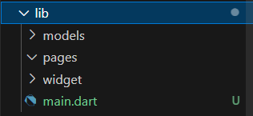

### Langkah 2

> Definisi Route

Buatlah dua buah file dart dengan nama home_page.dart dan item_page.dart pada folder pages. Untuk masing-masing file, deklarasikan class HomePage pada file home_page.dart dan ItemPage pada item_page.dart. Turunkan class dari StatelessWidget

#### home_page.dart

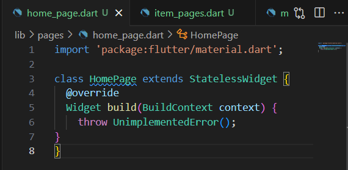

#### item_page.dart

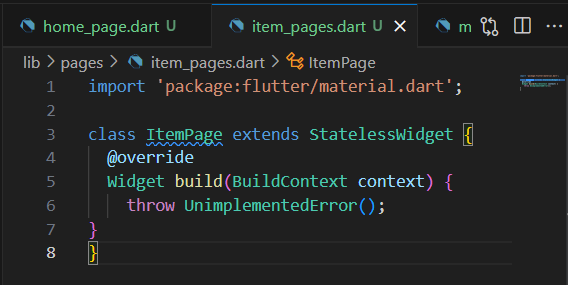

### Langkah 3

> Kode Program Pada Main.dart

Definisi penamaan route. Halaman HomePage didefinisikan sebagai /. Dan halaman ItemPage didefinisikan sebagai /item.

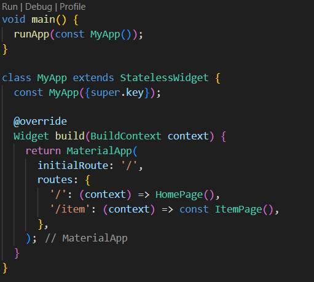

### Langkah 4

> Data Model

Sebelum melakukan perpindahan halaman dari HomePage ke ItemPage, dibutuhkan proses pemodelan data. Membuat sebuah file dengan nama item.dart dan letakkan pada folder models

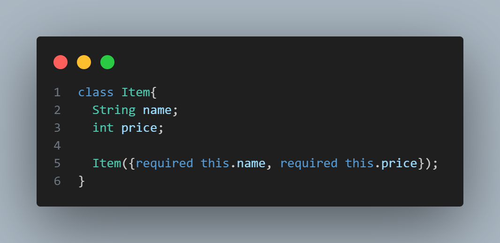

### Langkah 5

> Kode Program Pada HomePage

Pada halaman HomePage terdapat ListView widget. Sumber data ListView diambil dari model List dari object Item

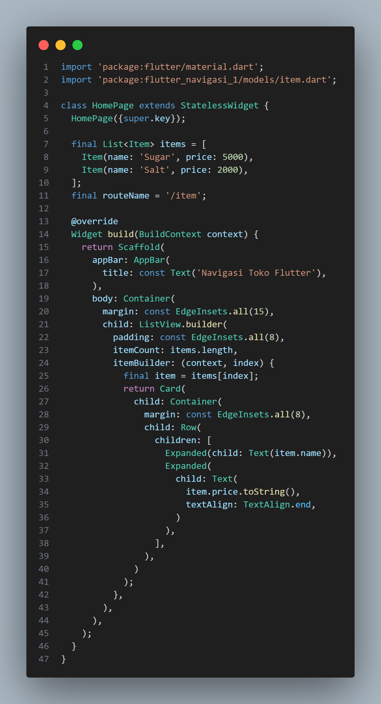

### Langkah 6

> ListView dan itemBuilder

Untuk menampilkan **_ListView_** pada praktikum ini digunakan **_itemBuilder_**. Data diambil dari definisi model yang telah dibuat sebelumnya. Untuk menunjukkan batas data satu dan berikutnya digunakan widget **_Card_**

### Langkah 7

> Menambahkan aksi pada ListView

Item pada ListView saat ini ketika ditekan masih belum memberikan aksi tertentu. Untuk menambahkan aksi pada ListView dapat digunakan widget InkWell

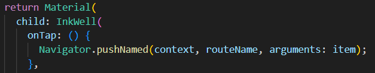

### Tugas Praktikum 2

> Mengubah Kode Program Pada HomePage dan ItemPage

#### HomePage

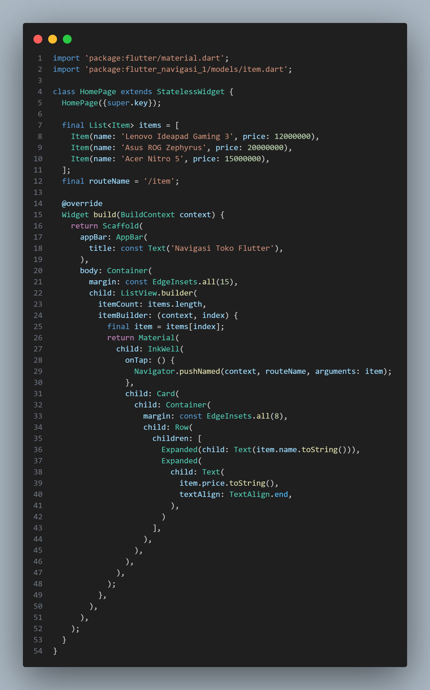

#### ItemPage

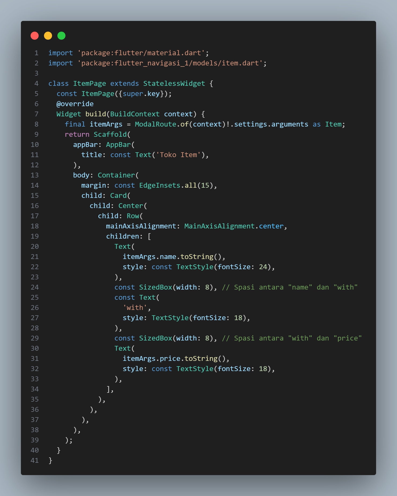

### Hasil Akhir

> HomePage

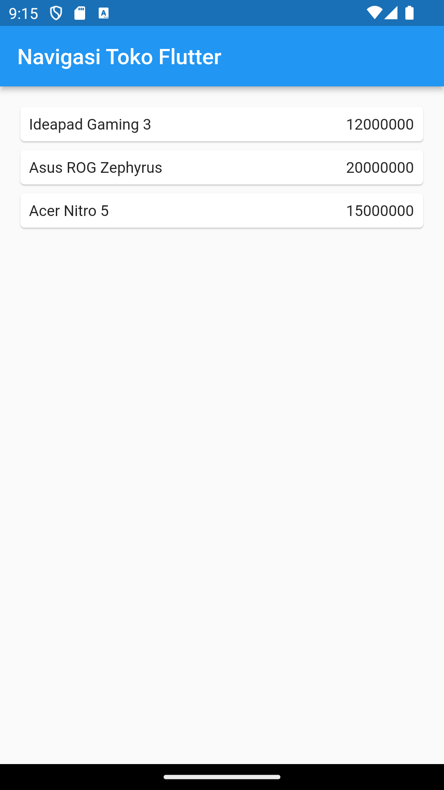

> Item 1

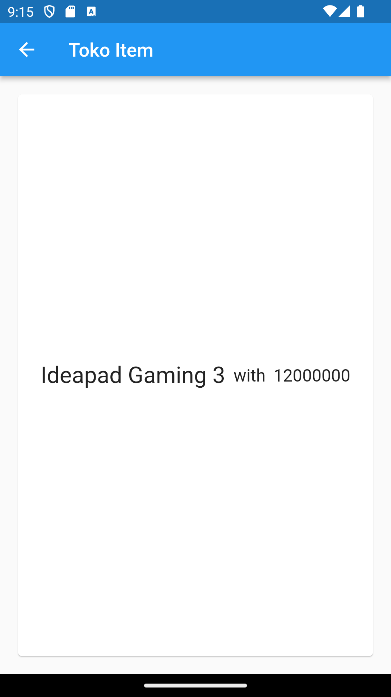

> Item 2

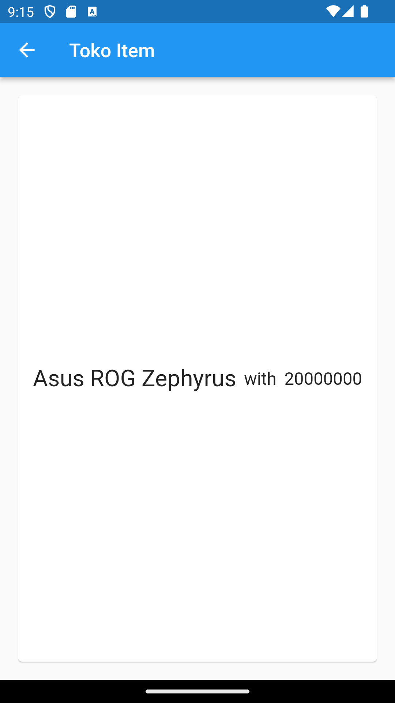

> Item 3

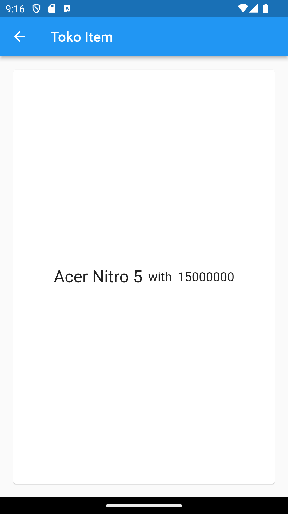
