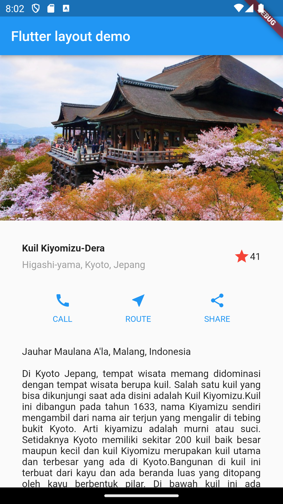

# flutter_layout_1

A new Flutter project.

## Getting Started

This project is a starting point for a Flutter application.

A few resources to get you started if this is your first Flutter project:

- [Lab: Write your first Flutter app](https://docs.flutter.dev/get-started/codelab)
- [Cookbook: Useful Flutter samples](https://docs.flutter.dev/cookbook)

## Praktikum 1
> Membangun Layout di FLutter

### Langkah 1
> Buat sebuah project baru dengan nama ***flutter_layout_1*** lalu Ubah code program pada ***main.dart***

### Langkah 2
> Tambahkan kode berikut di bagian atas metode ***build()*** di dalam kelas ***MyApp***

### Hasil Akhir

## Praktikum 2
> Implementasi Button Row

### Langkah 1
> Membuat method Column ***_buildButtonColumn***

Membuat metode pembantu pribadi bernama buildButtonColumn(), yang mempunyai parameter warna, Icon dan Text, sehingga dapat mengembalikan kolom dengan widgetnya sesuai dengan warna tertentu.

### Langkah 2
> Code Program

### Hasil Akhir

## Praktikum 3
>Implementasi Text Section

### Langkah 1 
> Code program

### Hasil Akhir

## Praktikum 4
>Implementasi Image Section

### Langkah 1 
> Menyiapkan Aset Gambar

> Code program

### Langkah 2
> Menambahakan Gambar ke Body

> Code program

### Hasil Akhir

